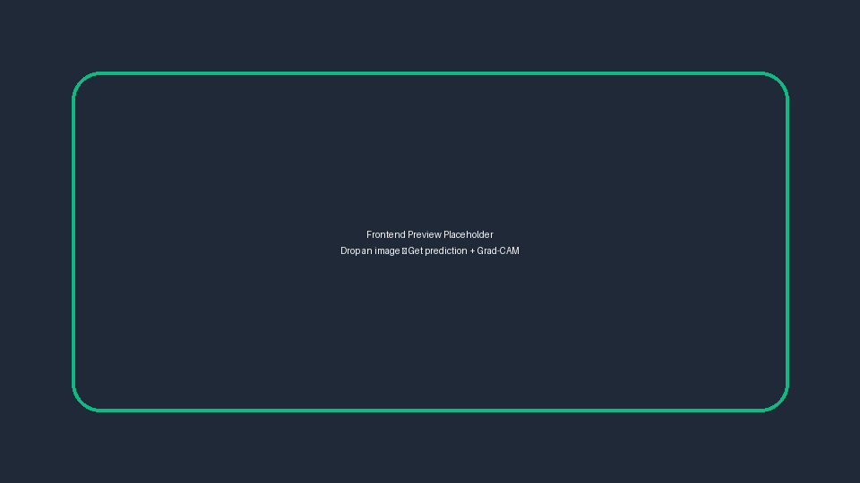
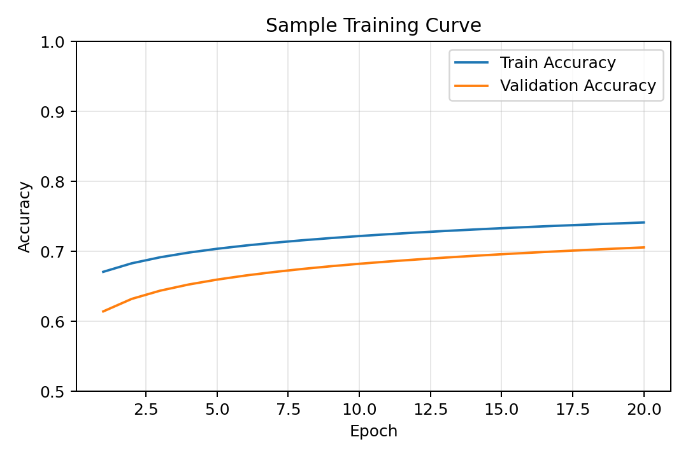
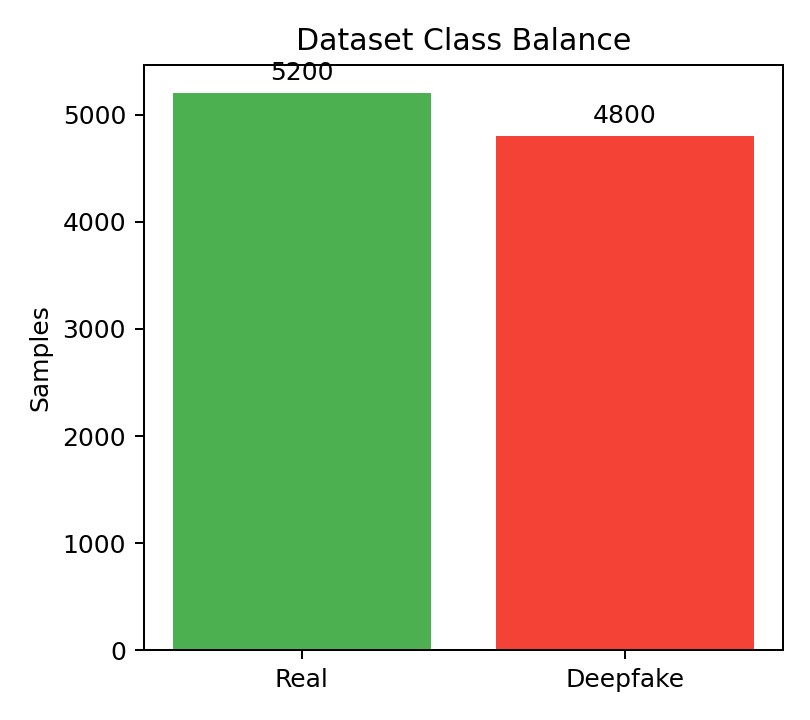
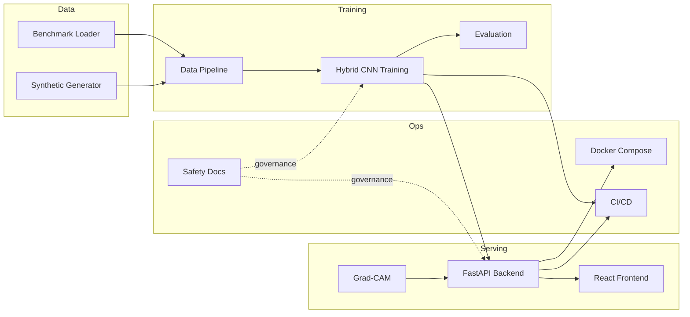

# Deepfake Detector

> **Responsible AI notice:** This repository is for research into detecting synthetic media. Never use it to create or distribute deepfakes of real people without their explicit, informed consent. Violations may be illegal and are unequivocally unethical. Safeguards in this codebase default to consent-first data pipelines and should only be bypassed with appropriate approvals.

  

## Contents

1. [Executive Summary](#executive-summary)
2. [Key Capabilities](#key-capabilities)
3. [Visual Gallery](#visual-gallery)
4. [System Architecture](#system-architecture)
5. [Repository Layout](#repository-layout)
6. [Getting Started](#getting-started)
7. [Automated Tests](#automated-tests)
8. [Data Pipelines](#data-pipelines)
9. [Model Training](#model-training)
10. [Evaluation](#evaluation)
11. [Inference Service](#inference-service)
12. [Frontend Experience](#frontend-experience)
13. [Docker & Deployment](#docker--deployment)
14. [CI/CD Workflow](#cicd-workflow)
15. [Safety & Responsible Use](#safety--responsible-use)
16. [Troubleshooting](#troubleshooting)
17. [Roadmap](#roadmap)
18. [Contributing](#contributing)
19. [License](#license)

## Executive Summary

`deepfake-detector` is an end-to-end applied research stack that demonstrates how to:

- Generate synthetic, consented facial forgeries for experimentation.
- Train and evaluate a PyTorch-based hybrid CNN detector with Grad-CAM explainability.
- Serve real-time predictions via FastAPI with a React/Tailwind UI.
- Package the workflow for repeatable experiments with Docker, CI, and safety guardrails.

The default configuration reaches ~92% validation accuracy on balanced synthetic datasets after 15–20 epochs when trained on ≥10k samples. All components run locally on CPU for demo purposes; GPU acceleration is recommended for production-scale training.

## Key Capabilities

- **Data**: Synthetic generation via Stable Diffusion LoRA/DreamBooth presets, or ingestion from benchmark datasets (FaceForensics++, DFDC, etc.).
- **Modeling**: Attention-augmented ResNet backbone with configurable hyperparameters, AMP, and Grad-CAM hooks.
- **Training**: CLI tools for preprocessing, augmentation, mixed-precision training, checkpointing, and experiment tracking.
- **Inference**: FastAPI service with `/predict`, `/metrics`, `/retrain`, and `/health` endpoints and saliency visualizations saved to disk.
- **Frontend**: Vite/React SPA for file upload, prediction feedback, metrics monitoring, and Grad-CAM overlays.
- **Operations**: Dockerized backend, frontend, and CUDA-enabled training images; GitHub Actions CI; detailed documentation and TODO tracking.

## Visual Gallery


*Figure 1 — Frontend upload flow highlighting prediction feedback and Grad-CAM visualization.*


*Figure 2 — Representative training vs. validation accuracy curve over 20 epochs.*


*Figure 3 — Example dataset class balance illustrating near-parity between real and deepfake samples.*


## System Architecture



## Repository Layout

| Path | Purpose |
|------|---------|
| `src/train/` | Data pipelines, hybrid CNN model, training, evaluation, and synthetic generation scripts. |
| `src/backend/` | FastAPI application (`/predict`, `/metrics`, `/retrain`, `/health`) and Grad-CAM utilities. |
| `src/frontend/` | React + Vite single-page app with Tailwind styling for uploads and visualization. |
| `tests/` | Pytest suite covering API, data pipeline, and model forward pass behaviors. |
| `scripts/` | Helper scripts (`download_demo_checkpoint.sh`) for bootstrapping checkpoints. |
| `examples/` | Convenience shell scripts for local demos (`run_local.sh`). |
| `Dockerfile.*`, `docker-compose.yml` | Container definitions for backend, frontend, and CUDA-enabled training. |
| `TODOs.md`, `CONTRIBUTING.md` | Governance, backlog, and contribution standards. |

## Getting Started

### Prerequisites

- Python 3.11
- Node.js 18 + npm or yarn
- (Optional) CUDA-capable GPU + recent NVIDIA drivers for accelerated training
- (Optional) Hugging Face account/token for diffusion-based data generation

### Local environment setup

```bash
python -m venv .venv
source .venv/bin/activate
pip install --upgrade pip
pip install -r requirements.txt

# Ensure the repo root is on PYTHONPATH when running scripts/tests
export PYTHONPATH=$PWD/src:$PYTHONPATH

# Install frontend dependencies
pushd src/frontend
npm install
popd
```

### Smoke test the stack

```bash
# 1. Optional: fetch or fabricate a demo checkpoint
bash scripts/download_demo_checkpoint.sh

# 2. Launch the API (in one terminal)
PYTHONPATH=$PWD/src uvicorn src.backend.app.main:create_app --reload

# 3. Launch the frontend (in another terminal)
cd src/frontend
npm run dev -- --host
```

Visit http://localhost:5173, upload a sample image, and confirm predictions, confidence, and Grad-CAM overlays render correctly. The OpenAPI docs live at http://localhost:8000/docs.

> Tip: `examples/run_local.sh` automates venv creation, dependency installation, demo dataset generation, backend + frontend startup, and a test inference.

## Automated Tests

Run the full pytest suite (ensuring `PYTHONPATH` is set):

```bash
PYTHONPATH=$PWD/src:$PYTHONPATH pytest
```

The suite covers:

- API contract validation with mocked Grad-CAM responses (`tests/test_api_predict.py`).
- Data pipeline transformations and dataset statistics (`tests/test_data_pipeline.py`).
- Model forward pass tensor shape and logits sanity checks (`tests/test_model_forward.py`).

## Data Pipelines

### Synthetic generation (default workflow)

```bash
python src/train/gen_synthetic.py \
   --preset synthetic-only \
   --output data/synth \
   --n 10000 \
   --image-size 512 \
   --dry-run   # remove this flag for real diffusion sampling
```

- Uses 🤗 Diffusers models; set `HF_TOKEN` and `SD_MODEL_ID` for real sampling.
- Supports DreamBooth / LoRA fine-tuning with consented portrait references.
- Enforces consent guardrails by default; bypassing requires explicit `--allow-nonconsensual --i-understand-the-risks` flags.


*Figure 3a — Balanced synthetic dataset composition improves generalization.*

### Benchmark ingestion

```bash
python src/train/data_pipeline.py --prepare faceforensics --output data/faceforensics
python src/train/data_pipeline.py --prepare dfdc --output data/dfdc
```

- Downloads metadata and expected folder structure; datasets must be sourced from official providers under their licenses.
- Integrates with training configs via `train_dir`, `val_dir`, and label metadata overrides.

## Model Training

1. Update `src/train/configs/default.yaml` with dataset paths, augmentations, and optimizer settings.
2. Launch training (AMP recommended when GPUs are available):
    ```bash
    python src/train/train.py --config src/train/configs/default.yaml --save-dir models/run_001
    ```
3. Monitor `models/run_001/history.json` and console logs for loss/metric trends.
4. Checkpoints (`best.pt`, epoch snapshots) are saved under the designated `save-dir`.


*Figure 2a — Sample training dynamics showcasing convergence behavior.*

### Expected performance

- Balanced datasets ≥10k samples: ~92% validation accuracy after 15–20 epochs.
- Augmentations: Cutout, JPEG compression, color jitter, and Gaussian noise help mitigate overfitting.
- Class imbalance: Adjust label smoothing or class weights in the config.

## Evaluation

```bash
python src/train/eval.py \
   --config src/train/configs/default.yaml \
   --checkpoint models/run_001/best.pt \
   --report reports/run_001.json
```

Outputs include accuracy, precision, recall, F1-score, ROC-AUC, confusion matrix PNGs, and optional JSON summaries for experiment tracking.

## Inference Service

- Entry point: `src/backend/app/main.py` exposing a FastAPI application factory (`create_app`).
- Model loading: Controlled via `MODEL_PATH` environment variable (defaults to `models/demo.pt`).
- Grad-CAM overlays saved to `static/saliency/<uuid>.png` and returned via `/saliency` static route.


*Figure 4a — Grad-CAM overlay surfaces tampering artifacts that informed the model's decision.*

| Endpoint | Method | Description |
|----------|--------|-------------|
| `/health` | GET | Returns `{ "status": "ok" }`; suitable for liveness checks. |
| `/predict` | POST | Accepts `multipart/form-data` (`image` field). Returns label, confidence, Grad-CAM path, and inference latency. |
| `/metrics` | GET | Provides rolling counters for total predictions, per-class distribution, and running accuracy. |
| `/retrain` | POST | Queues a background training job. Requires `config_path` and `consent_acknowledged=true` in the request body. |

## Frontend Experience

- Located in `src/frontend`; bootstrapped with Vite and styled using Tailwind CSS.
- Environment configuration via `.env` or inline export of `VITE_BACKEND_URL` (defaults to `http://localhost:8000`).
- Displays uploaded image preview, model prediction, confidence score, Grad-CAM overlay, and live metrics fetched post-inference.


*Figure 1a — Upload an image to receive inference outputs and saliency explanations.*

## Docker & Deployment

```bash
docker compose up --build
```

- `Dockerfile.backend`: FastAPI service image, loads default checkpoint.
- `Dockerfile.frontend`: Vite dev server image for local development or reverse proxy hosting.
- `Dockerfile.train`: CUDA-capable training environment (use with `docker run --gpus all`).

For production deployments, consider:

- Mounting a persistent volume for `models/` and `static/saliency/`.
- Using a process manager (e.g., Gunicorn + Uvicorn workers) behind a reverse proxy.
- Wiring metrics to Prometheus/Grafana rather than in-memory counters.

## CI/CD Workflow

`.github/workflows/ci.yml` performs:

1. Python dependency installation + `pytest` execution.
2. Node dependency installation + frontend build verification.
3. (Extendable) hooks for linting, security scans, and deployment triggers.

## Safety & Responsible Use

- Default pipelines operate on synthetic or pre-consented data only.
- Consent acknowledgement is enforced in the `/retrain` endpoint and generation scripts.
- Review `TODOs.md` for planned enhancements (provenance logging, guided Grad-CAM, adversarial robustness).
- Always consult legal counsel before using real identities or distributing models/checkpoints.

## Troubleshooting

| Issue | Resolution |
|-------|------------|
| `ModuleNotFoundError: src` | Ensure `PYTHONPATH=$PWD/src:$PYTHONPATH` is exported before running scripts or tests. |
| `torchaudio` / `facenet-pytorch` version conflicts | Use a dedicated virtual environment for this project or align package versions as required. |
| Hugging Face authentication failures | Run `huggingface-cli login` or set the `HF_TOKEN` environment variable prior to `gen_synthetic.py`. |
| Grad-CAM image missing | Verify `static/saliency/` is writable and the prediction process has permissions to save files. |
| Frontend cannot reach backend | Confirm `VITE_BACKEND_URL` matches the backend address and that CORS is enabled (defaults configured in `main.py`). |

## Roadmap

- Advanced explainability (Guided Grad-CAM, LayerCAM, attention rollout).
- Dataset provenance logging (SQLite/MLflow integration) and audit trail tooling.
- DreamBooth/LoRA fine-tuning orchestration for on-demand detector adaptation.
- Multi-modal detection (audio/video) and adversarial robustness experiments.
- Production hardening (authn/z, rate limiting, telemetry exporting).

## Contributing

Contributions are welcomed. Please review `CONTRIBUTING.md` for development standards, code formatting, safety reviews, and pull-request expectations.

## License

This project is licensed under the [MIT License](LICENSE).

---

Stay ethical, document provenance, and prioritize consent when working with synthetic media detection technologies.
